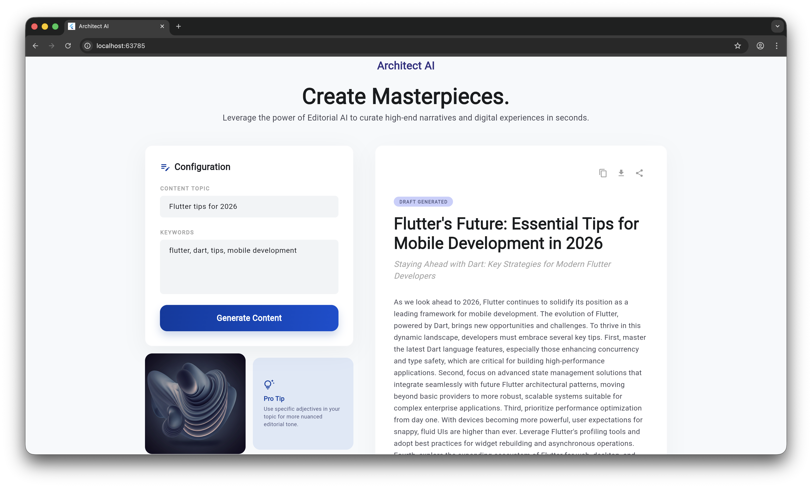

# AI Content Generator - Genkit Dart

A full-stack Dart application featuring a Flutter frontend and a Dart backend.

Genkit Dart for Flutter Developers - [Watch on youtube](https://youtu.be/_YPw1bCNpTo)

## Source Code Structure

This project follows a feature-based architecture separating the frontend UI and the backend logic.

### `lib/` (Flutter Frontend)

Contains the UI and client-side logic for the Flutter application.

- **`main.dart`**: The main entry point for the Flutter app.
- **`features/`**: Contains feature-specific code (e.g., `home_page.dart` and `home_controller.dart`).
- **`shared/`**: Contains shared resources used across the application:
  - `models/`: Application data models.
  - `services/`: Client-side services for API integration and business logic.
  - `theme/`: App-wide styling and themes.

### `backend/` (Dart Backend)

Contains the backend server environment.

- **`bin/my_genkit_app.dart`**: The main entry point for the Genkit backend application.

### Platform Directories

- `android/`, `ios/`, `macos/`, `linux/`, `windows/`, `web/`: Standard platform-specific directories for building the Flutter app for each respective target.

## Getting Started

For help getting started with Flutter development, view the [online documentation](https://docs.flutter.dev/).
